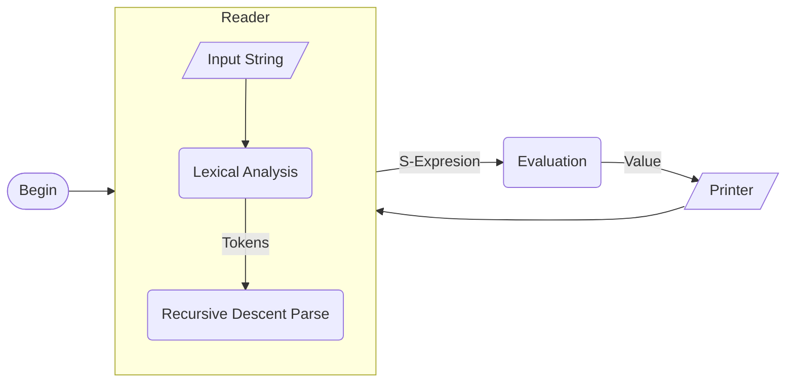

# lisp

**A core Lisp interpreter implemented in C.**

## Description
This project is a minimalist implementation of a Lisp runtime, built to explore the fundamentals of symbolic computation. It implements a complete **Read-Eval-Print Loop (REPL)** from scratch, featuring **manual memory management** (bump pointer allocation), **reference-counted stack frames**, and **lexical scoping** without external dependencies.

It serves as the reference code for my blog series, *[Roll A Lisp In C](https://swatson555.github.io/posts/2020-01-18-make-a-lisp-1.html)*.

## Architecture
The interpreter follows a recursive-descent architecture, transforming C character strings into linked-list data structures before evaluation.



## Usage

### Build
The project has zero dependencies and can be compiled with any standard C compiler.

```sh
cc -o lisp lisp.c
```

### Run REPL
Start the interactive session:
```sh
./lisp
# Lisp REPL
# >>
```

### Run File
Pass a file path to interpret a script:
```sh
./lisp fold.lisp
```

## Language Reference
The interpreter supports a subset of Scheme:

| Feature | Syntax / Example |
| :--- | :--- |
| **Arithmetic** | `(+ 1 2)`, `(- 10 5)`, `(* 2 3)`, `(/ 10 2)` |
| **Variables** | `(define x 10)`, `(set! x 20)` |
| **Logic** | `(if (= 1 1) #t #f)` |
| **Lists** | `(cons 1 2)`, `(car x)`, `(cdr x)`, `(list 1 2 3)` |
| **Lambdas** | `((lambda (x) (* x x)) 5)` |

## Caveats
* **Garbage Collection:** A full mark-and-sweep GC is omitted to keep the core runtime minimalist for study. The memory model is designed to be compatible with the **Boehm GC** as a drop-in replacement for `malloc` if long-running process support is required.
* **Error Handling:** The parser assumes well-formed input and may crash on unbalanced parentheses.

## Documentation
This codebase is documented in a 4-part series on language implementation:
1.  **[Reading](https://swatson555.github.io/posts/2020-01-18-make-a-lisp-1.html)** - Lexical analysis and parsing.
2.  **[Evaluation](https://swatson555.github.io/posts/2022-05-06-make-a-lisp-2.html)** - Recursion and syntax trees.
3.  **[Environments](https://swatson555.github.io/posts/2022-06-04-make-a-lisp-3.html)** - Symbol mapping and state.
4.  **[Procedures](https://swatson555.github.io/posts/2022-06-11-make-a-lisp-4.html)** - Closures and scoping.
